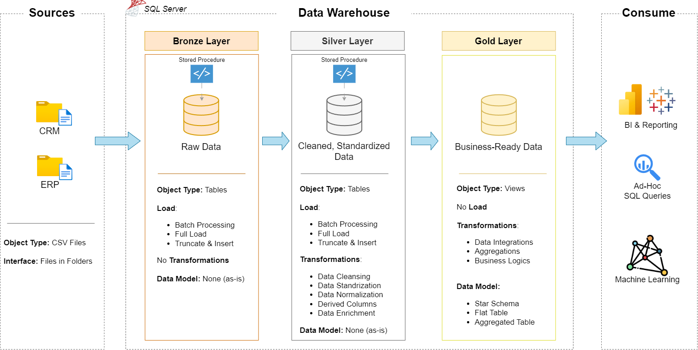
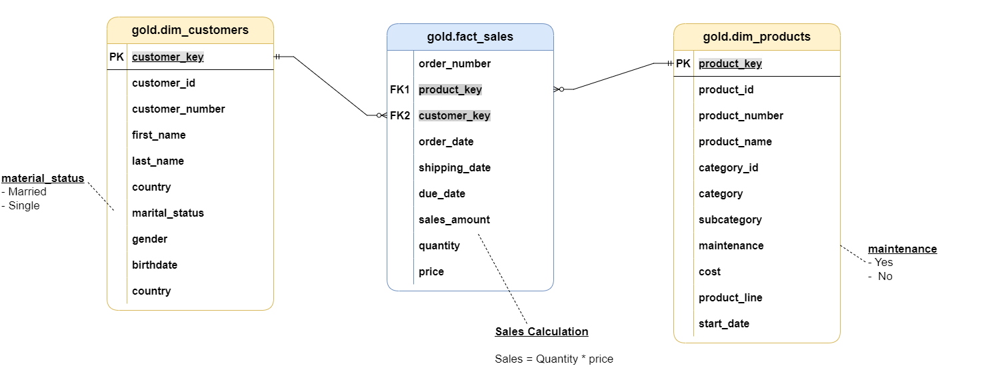
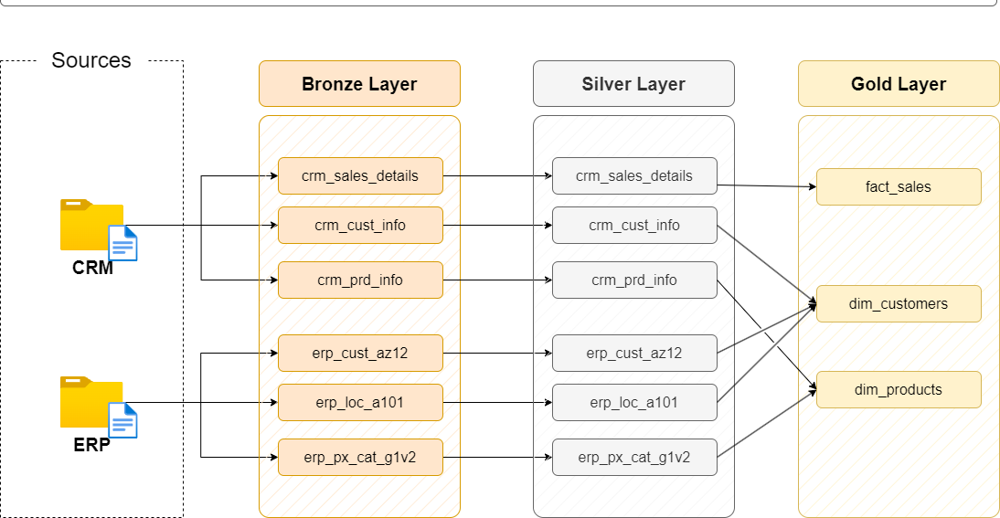
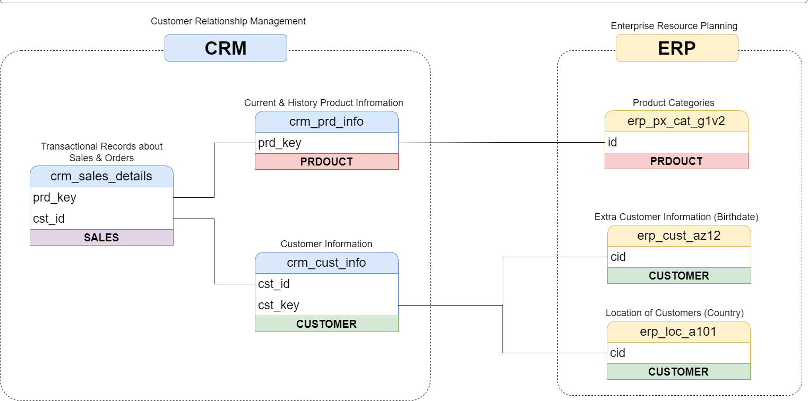

# SQL Data Warehouse Project
## Overview
This project demonstrates the design and implementation of a modern SQL Server Data Warehouse using CRM and ERP source data.
The project follows a layered architecture consisting of Bronze, Silver, and Gold layers. Raw CRM and ERP CSV files are loaded into the Bronze layer, transformed and cleansed in the Silver layer, and integrated into business-ready Gold views using a star-schema design
## Project Architecture
The data flows through the following layers:
CRM & ERP Sources
        ↓
Bronze Layer
        ↓
Silver Layer
        ↓
Gold Layer
        ↓
Analytics & Reporting

## Data Sources
The project uses two source systems:
### CRM
Customer and sales-related information:
- Customer information
- Product information
- Sales transactions
### ERP
Additional business information:
- Customer birthdate and gender
- Customer country/location
- Product categories and maintenance information
## Data Warehouse Layers
### Bronze Layer
The Bronze layer stores raw data from the CRM and ERP CSV files with minimal transformation.
Main tables:
- `bronze.crm_cust_info`
- `bronze.crm_prd_info`
- `bronze.crm_sales_details`
- `bronze.erp_loc_a101`
- `bronze.erp_cust_az12`
- `bronze.erp_px_cat_g1v2`
Data is loaded using SQL Server `BULK INSERT`.
### Silver Layer
The Silver layer cleans, standardizes, and transforms the Bronze data.
Key transformations include:
- Data cleansing
- Duplicate removal
- Standardizing gender and marital status
- Handling missing values
- Date conversion
- Product category extraction
- Product history date calculation
- Data integration between CRM and ERP
Main tables:
- `silver.crm_cust_info`
- `silver.crm_prd_info`
- `silver.crm_sales_details`
- `silver.erp_loc_a101`
- `silver.erp_cust_az12`
- `silver.erp_px_cat_g1v2`
### Gold Layer
The Gold layer provides business-ready data for analytics and reporting.
Main views:
- `gold.dim_customers`
- `gold.dim_products`
- `gold.fact_sales`
The Gold layer follows a star-schema design consisting of fact and dimension views.

## ETL Process
### Bronze ETL
Source CSV files are loaded into Bronze tables using the `bronze.load_bronze` stored procedure.
### Silver ETL
Bronze data is cleaned and transformed using the `silver.load_silver` stored procedure.
### Gold Transformation
Silver data is integrated into business-ready dimension and fact views.
## Data Flow

## Data Integration
CRM and ERP data are integrated to create enriched customer and product information.

## Technologies Used
- Microsoft SQL Server
- T-SQL
- SQL Server Stored Procedures
- SQL Views
- BULK INSERT
- CTEs
- Window Functions
- Data Cleansing
- Data Transformation
- Star Schema
- ETL / Data Warehousing

